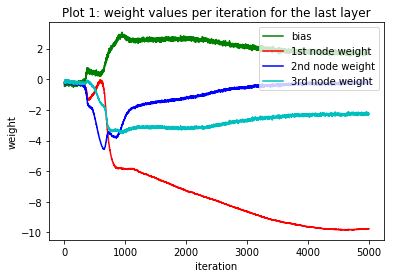
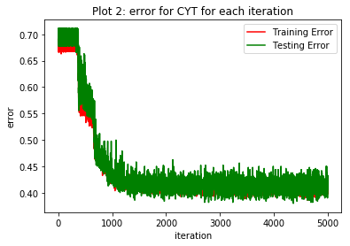
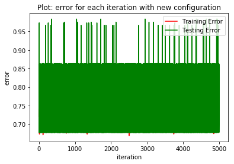

# Feed Forward Artificial Neural Network to predict Yeast class from biological data

## Step 1: Outlier Detection 
### Using 2 outlier detection algorithms to find outliers in the data set, and using a single method to remove the outliers from the data set.

```python
import pandas as pd
import numpy as np
from sklearn.ensemble import IsolationForest
from sklearn.svm import OneClassSVM


# reading in the data file
inFile = "yeast.data"
dataFile = open(inFile, "r")

from sklearn.ensemble import IsolationForest

# creating empty list for the different variables
seqNameData = []
mcgData = []
gvhData = []
almData = []
mitData = []
erlData = []
poxData = []
vacData = []
nucData = []
classDisData = []

# appending data to corresponding lists
for row in dataFile.readlines():
    data = row.split()
    mcgData.append(float(data[1]))
    gvhData.append(float(data[2]))
    almData.append(float(data[3]))
    mitData.append(float(data[4]))
    erlData.append(float(data[5]))
    poxData.append(float(data[6]))
    vacData.append(float(data[7]))
    nucData.append(float(data[8]))
    classDisData.append((data[9]))

# creating data frame from the lists
feature_data = {'mcg': mcgData, 'gvh': gvhData, 'alm': almData, 'mit': mitData, 'erl': erlData, 'pox': poxData, 'vac': vacData, 'nuc': nucData}
features = pd.DataFrame(feature_data, columns = ['mcg','gvh','alm','mit','erl','pox','vac','nuc'])
featuresMatrix = features.values

# using isolation forest for 1st method for outlier detectioin
# everything si set to default, except outier threshold is 4%
clf = IsolationForest(contamination=0.04, behaviour="new").fit(featuresMatrix)
isoForest_pred = clf.predict(featuresMatrix)
isoForest_predList = isoForest_pred.tolist() 

# since iForest gives outliers as -1, collecting indices of where the 
# outliers are
outlierInd_isoForest = []
count = 0
for elements in isoForest_predList:
    if isoForest_predList[count] == -1:
        outlierInd_isoForest.append(count)
    count = count + 1
print(len(outlierInd_isoForest))
print(outlierInd_isoForest)

# using one 1 class SVM for second oulier detection method, setting 
# everything to default, and making threshold 4% for outliers
clf2 = OneClassSVM(gamma='auto', nu=0.04).fit(featuresMatrix)
oneClassSVM_pred = clf2.predict(featuresMatrix)
oneClassSVM_predList = oneClassSVM_pred.tolist()

# collecting indices of where the outiers are
outlierInd_OVM = []
count = 0
for elements in oneClassSVM_predList:
    if oneClassSVM_predList[count] == -1:
        outlierInd_OVM.append(count)
    count = count + 1
print(len(outlierInd_OVM))
print(outlierInd_OVM)

# removing indices with ouliers
mcgData_flt = [data for index, data in enumerate(mcgData) if index not in outlierInd_isoForest]
gvhData_flt = [data for index, data in enumerate(gvhData) if index not in outlierInd_isoForest]
almData_flt = [data for index, data in enumerate(almData) if index not in outlierInd_isoForest]
mitData_flt = [data for index, data in enumerate(mitData) if index not in outlierInd_isoForest]
erlData_flt = [data for index, data in enumerate(erlData) if index not in outlierInd_isoForest]
poxData_flt = [data for index, data in enumerate(poxData) if index not in outlierInd_isoForest]
vacData_flt = [data for index, data in enumerate(vacData) if index not in outlierInd_isoForest]
nucData_flt = [data for index, data in enumerate(nucData) if index not in outlierInd_isoForest]
classDisData_flt = [data for index, data in enumerate(classDisData) if index not in outlierInd_isoForest]

# creating new datafreame without ouliers
raw_data_flt = {'mcg': mcgData_flt, 'gvh': gvhData_flt, 'alm': almData_flt, 'mit': mitData_flt, 'erl': erlData_flt, 'pox': poxData_flt, 'vac': vacData_flt, 'nuc': nucData_flt, 'Yeast Class': classDisData_flt}
raw_flt = pd.DataFrame(raw_data_flt, columns = ['mcg','gvh','alm','mit','erl','pox','vac','nuc', 'Yeast Class'])

raw_fltMatrix = raw_flt.values
```

    60
    [29, 84, 148, 219, 271, 304, 306, 319, 325, 333, 395, 424, 470, 488, 500, 503, 505, 506, 508, 553, 558, 589, 592, 598, 609, 659, 707, 720, 739, 745, 764, 787, 796, 797, 841, 875, 881, 988, 989, 990, 1000, 1058, 1077, 1105, 1109, 1114, 1125, 1145, 1155, 1182, 1252, 1287, 1356, 1357, 1382, 1388, 1389, 1423, 1450, 1452]
    60
    [31, 84, 114, 175, 219, 250, 258, 271, 304, 306, 319, 326, 333, 424, 470, 488, 501, 503, 505, 506, 553, 558, 592, 598, 609, 684, 707, 720, 739, 764, 796, 797, 841, 874, 881, 988, 989, 990, 1039, 1077, 1079, 1105, 1109, 1145, 1155, 1182, 1184, 1200, 1213, 1216, 1252, 1287, 1356, 1382, 1388, 1389, 1423, 1434, 1450, 1454]
    


<div>
<style scoped>
    .dataframe tbody tr th:only-of-type {
        vertical-align: middle;
    }

    .dataframe tbody tr th {
        vertical-align: top;
    }

    .dataframe thead th {
        text-align: right;
    }
</style>
<table border="1" class="dataframe">
  <thead>
    <tr style="text-align: right;">
      <th></th>
      <th>mcg</th>
      <th>gvh</th>
      <th>alm</th>
      <th>mit</th>
      <th>erl</th>
      <th>pox</th>
      <th>vac</th>
      <th>nuc</th>
      <th>Yeast Class</th>
    </tr>
  </thead>
  <tbody>
    <tr>
      <th>0</th>
      <td>0.58</td>
      <td>0.61</td>
      <td>0.47</td>
      <td>0.13</td>
      <td>0.5</td>
      <td>0.0</td>
      <td>0.48</td>
      <td>0.22</td>
      <td>MIT</td>
    </tr>
    <tr>
      <th>1</th>
      <td>0.43</td>
      <td>0.67</td>
      <td>0.48</td>
      <td>0.27</td>
      <td>0.5</td>
      <td>0.0</td>
      <td>0.53</td>
      <td>0.22</td>
      <td>MIT</td>
    </tr>
    <tr>
      <th>2</th>
      <td>0.64</td>
      <td>0.62</td>
      <td>0.49</td>
      <td>0.15</td>
      <td>0.5</td>
      <td>0.0</td>
      <td>0.53</td>
      <td>0.22</td>
      <td>MIT</td>
    </tr>
    <tr>
      <th>3</th>
      <td>0.58</td>
      <td>0.44</td>
      <td>0.57</td>
      <td>0.13</td>
      <td>0.5</td>
      <td>0.0</td>
      <td>0.54</td>
      <td>0.22</td>
      <td>NUC</td>
    </tr>
    <tr>
      <th>4</th>
      <td>0.42</td>
      <td>0.44</td>
      <td>0.48</td>
      <td>0.54</td>
      <td>0.5</td>
      <td>0.0</td>
      <td>0.48</td>
      <td>0.22</td>
      <td>MIT</td>
    </tr>
    <tr>
      <th>5</th>
      <td>0.51</td>
      <td>0.40</td>
      <td>0.56</td>
      <td>0.17</td>
      <td>0.5</td>
      <td>0.5</td>
      <td>0.49</td>
      <td>0.22</td>
      <td>CYT</td>
    </tr>
    <tr>
      <th>6</th>
      <td>0.50</td>
      <td>0.54</td>
      <td>0.48</td>
      <td>0.65</td>
      <td>0.5</td>
      <td>0.0</td>
      <td>0.53</td>
      <td>0.22</td>
      <td>MIT</td>
    </tr>
    <tr>
      <th>7</th>
      <td>0.48</td>
      <td>0.45</td>
      <td>0.59</td>
      <td>0.20</td>
      <td>0.5</td>
      <td>0.0</td>
      <td>0.58</td>
      <td>0.34</td>
      <td>NUC</td>
    </tr>
    <tr>
      <th>8</th>
      <td>0.55</td>
      <td>0.50</td>
      <td>0.66</td>
      <td>0.36</td>
      <td>0.5</td>
      <td>0.0</td>
      <td>0.49</td>
      <td>0.22</td>
      <td>MIT</td>
    </tr>
    <tr>
      <th>9</th>
      <td>0.40</td>
      <td>0.39</td>
      <td>0.60</td>
      <td>0.15</td>
      <td>0.5</td>
      <td>0.0</td>
      <td>0.58</td>
      <td>0.30</td>
      <td>CYT</td>
    </tr>
    <tr>
      <th>10</th>
      <td>0.43</td>
      <td>0.39</td>
      <td>0.54</td>
      <td>0.21</td>
      <td>0.5</td>
      <td>0.0</td>
      <td>0.53</td>
      <td>0.27</td>
      <td>NUC</td>
    </tr>
    <tr>
      <th>11</th>
      <td>0.42</td>
      <td>0.37</td>
      <td>0.59</td>
      <td>0.20</td>
      <td>0.5</td>
      <td>0.0</td>
      <td>0.52</td>
      <td>0.29</td>
      <td>NUC</td>
    </tr>
    <tr>
      <th>12</th>
      <td>0.40</td>
      <td>0.42</td>
      <td>0.57</td>
      <td>0.35</td>
      <td>0.5</td>
      <td>0.0</td>
      <td>0.53</td>
      <td>0.25</td>
      <td>CYT</td>
    </tr>
    <tr>
      <th>13</th>
      <td>0.60</td>
      <td>0.40</td>
      <td>0.52</td>
      <td>0.46</td>
      <td>0.5</td>
      <td>0.0</td>
      <td>0.53</td>
      <td>0.22</td>
      <td>MIT</td>
    </tr>
    <tr>
      <th>14</th>
      <td>0.66</td>
      <td>0.55</td>
      <td>0.45</td>
      <td>0.19</td>
      <td>0.5</td>
      <td>0.0</td>
      <td>0.46</td>
      <td>0.22</td>
      <td>MIT</td>
    </tr>
    <tr>
      <th>15</th>
      <td>0.46</td>
      <td>0.44</td>
      <td>0.52</td>
      <td>0.11</td>
      <td>0.5</td>
      <td>0.0</td>
      <td>0.50</td>
      <td>0.22</td>
      <td>CYT</td>
    </tr>
    <tr>
      <th>16</th>
      <td>0.47</td>
      <td>0.39</td>
      <td>0.50</td>
      <td>0.11</td>
      <td>0.5</td>
      <td>0.0</td>
      <td>0.49</td>
      <td>0.40</td>
      <td>CYT</td>
    </tr>
    <tr>
      <th>17</th>
      <td>0.58</td>
      <td>0.47</td>
      <td>0.54</td>
      <td>0.11</td>
      <td>0.5</td>
      <td>0.0</td>
      <td>0.51</td>
      <td>0.26</td>
      <td>NUC</td>
    </tr>
    <tr>
      <th>18</th>
      <td>0.50</td>
      <td>0.34</td>
      <td>0.55</td>
      <td>0.21</td>
      <td>0.5</td>
      <td>0.0</td>
      <td>0.49</td>
      <td>0.22</td>
      <td>NUC</td>
    </tr>
    <tr>
      <th>19</th>
      <td>0.61</td>
      <td>0.60</td>
      <td>0.55</td>
      <td>0.21</td>
      <td>0.5</td>
      <td>0.0</td>
      <td>0.50</td>
      <td>0.25</td>
      <td>NUC</td>
    </tr>
    <tr>
      <th>20</th>
      <td>0.45</td>
      <td>0.40</td>
      <td>0.50</td>
      <td>0.16</td>
      <td>0.5</td>
      <td>0.0</td>
      <td>0.50</td>
      <td>0.22</td>
      <td>CYT</td>
    </tr>
    <tr>
      <th>21</th>
      <td>0.43</td>
      <td>0.44</td>
      <td>0.48</td>
      <td>0.22</td>
      <td>0.5</td>
      <td>0.0</td>
      <td>0.51</td>
      <td>0.22</td>
      <td>CYT</td>
    </tr>
    <tr>
      <th>22</th>
      <td>0.73</td>
      <td>0.63</td>
      <td>0.42</td>
      <td>0.30</td>
      <td>0.5</td>
      <td>0.0</td>
      <td>0.49</td>
      <td>0.22</td>
      <td>CYT</td>
    </tr>
    <tr>
      <th>23</th>
      <td>0.43</td>
      <td>0.53</td>
      <td>0.52</td>
      <td>0.13</td>
      <td>0.5</td>
      <td>0.0</td>
      <td>0.55</td>
      <td>0.22</td>
      <td>CYT</td>
    </tr>
    <tr>
      <th>24</th>
      <td>0.46</td>
      <td>0.53</td>
      <td>0.52</td>
      <td>0.15</td>
      <td>0.5</td>
      <td>0.0</td>
      <td>0.58</td>
      <td>0.22</td>
      <td>CYT</td>
    </tr>
    <tr>
      <th>25</th>
      <td>0.51</td>
      <td>0.51</td>
      <td>0.52</td>
      <td>0.51</td>
      <td>0.5</td>
      <td>0.0</td>
      <td>0.54</td>
      <td>0.22</td>
      <td>MIT</td>
    </tr>
    <tr>
      <th>26</th>
      <td>0.59</td>
      <td>0.45</td>
      <td>0.53</td>
      <td>0.19</td>
      <td>0.5</td>
      <td>0.0</td>
      <td>0.59</td>
      <td>0.27</td>
      <td>CYT</td>
    </tr>
    <tr>
      <th>27</th>
      <td>0.57</td>
      <td>0.47</td>
      <td>0.60</td>
      <td>0.18</td>
      <td>0.5</td>
      <td>0.0</td>
      <td>0.51</td>
      <td>0.22</td>
      <td>CYT</td>
    </tr>
    <tr>
      <th>28</th>
      <td>0.63</td>
      <td>0.67</td>
      <td>0.57</td>
      <td>0.24</td>
      <td>0.5</td>
      <td>0.0</td>
      <td>0.49</td>
      <td>0.22</td>
      <td>MIT</td>
    </tr>
    <tr>
      <th>29</th>
      <td>0.53</td>
      <td>0.54</td>
      <td>0.43</td>
      <td>0.10</td>
      <td>0.5</td>
      <td>0.0</td>
      <td>0.57</td>
      <td>0.32</td>
      <td>NUC</td>
    </tr>
    <tr>
      <th>...</th>
      <td>...</td>
      <td>...</td>
      <td>...</td>
      <td>...</td>
      <td>...</td>
      <td>...</td>
      <td>...</td>
      <td>...</td>
      <td>...</td>
    </tr>
    <tr>
      <th>1394</th>
      <td>0.57</td>
      <td>0.59</td>
      <td>0.49</td>
      <td>0.86</td>
      <td>0.5</td>
      <td>0.0</td>
      <td>0.47</td>
      <td>0.22</td>
      <td>NUC</td>
    </tr>
    <tr>
      <th>1395</th>
      <td>0.38</td>
      <td>0.40</td>
      <td>0.39</td>
      <td>0.19</td>
      <td>0.5</td>
      <td>0.0</td>
      <td>0.46</td>
      <td>0.62</td>
      <td>NUC</td>
    </tr>
    <tr>
      <th>1396</th>
      <td>0.77</td>
      <td>0.74</td>
      <td>0.37</td>
      <td>0.29</td>
      <td>0.5</td>
      <td>0.0</td>
      <td>0.45</td>
      <td>0.22</td>
      <td>ME1</td>
    </tr>
    <tr>
      <th>1397</th>
      <td>0.47</td>
      <td>0.38</td>
      <td>0.58</td>
      <td>0.19</td>
      <td>0.5</td>
      <td>0.0</td>
      <td>0.57</td>
      <td>0.22</td>
      <td>CYT</td>
    </tr>
    <tr>
      <th>1398</th>
      <td>0.50</td>
      <td>0.61</td>
      <td>0.44</td>
      <td>0.20</td>
      <td>0.5</td>
      <td>0.0</td>
      <td>0.49</td>
      <td>0.22</td>
      <td>MIT</td>
    </tr>
    <tr>
      <th>1399</th>
      <td>0.41</td>
      <td>0.45</td>
      <td>0.46</td>
      <td>0.23</td>
      <td>0.5</td>
      <td>0.0</td>
      <td>0.50</td>
      <td>0.70</td>
      <td>CYT</td>
    </tr>
    <tr>
      <th>1400</th>
      <td>0.46</td>
      <td>0.62</td>
      <td>0.46</td>
      <td>0.54</td>
      <td>0.5</td>
      <td>0.0</td>
      <td>0.51</td>
      <td>0.27</td>
      <td>MIT</td>
    </tr>
    <tr>
      <th>1401</th>
      <td>0.74</td>
      <td>0.75</td>
      <td>0.45</td>
      <td>0.44</td>
      <td>0.5</td>
      <td>0.0</td>
      <td>0.52</td>
      <td>0.22</td>
      <td>POX</td>
    </tr>
    <tr>
      <th>1402</th>
      <td>0.52</td>
      <td>0.53</td>
      <td>0.58</td>
      <td>0.69</td>
      <td>0.5</td>
      <td>0.0</td>
      <td>0.50</td>
      <td>0.22</td>
      <td>MIT</td>
    </tr>
    <tr>
      <th>1403</th>
      <td>0.41</td>
      <td>0.47</td>
      <td>0.50</td>
      <td>0.14</td>
      <td>0.5</td>
      <td>0.0</td>
      <td>0.53</td>
      <td>0.37</td>
      <td>NUC</td>
    </tr>
    <tr>
      <th>1404</th>
      <td>0.25</td>
      <td>0.40</td>
      <td>0.52</td>
      <td>0.15</td>
      <td>0.5</td>
      <td>0.0</td>
      <td>0.56</td>
      <td>0.28</td>
      <td>NUC</td>
    </tr>
    <tr>
      <th>1405</th>
      <td>0.58</td>
      <td>0.56</td>
      <td>0.38</td>
      <td>0.39</td>
      <td>0.5</td>
      <td>0.0</td>
      <td>0.54</td>
      <td>0.57</td>
      <td>NUC</td>
    </tr>
    <tr>
      <th>1406</th>
      <td>0.32</td>
      <td>0.29</td>
      <td>0.29</td>
      <td>0.08</td>
      <td>0.5</td>
      <td>0.0</td>
      <td>0.52</td>
      <td>0.22</td>
      <td>ME3</td>
    </tr>
    <tr>
      <th>1407</th>
      <td>0.38</td>
      <td>0.48</td>
      <td>0.57</td>
      <td>0.30</td>
      <td>0.5</td>
      <td>0.0</td>
      <td>0.41</td>
      <td>0.11</td>
      <td>CYT</td>
    </tr>
    <tr>
      <th>1408</th>
      <td>0.39</td>
      <td>0.58</td>
      <td>0.47</td>
      <td>0.18</td>
      <td>0.5</td>
      <td>0.0</td>
      <td>0.48</td>
      <td>0.22</td>
      <td>MIT</td>
    </tr>
    <tr>
      <th>1409</th>
      <td>0.38</td>
      <td>0.47</td>
      <td>0.47</td>
      <td>0.18</td>
      <td>0.5</td>
      <td>0.0</td>
      <td>0.44</td>
      <td>0.26</td>
      <td>MIT</td>
    </tr>
    <tr>
      <th>1410</th>
      <td>0.63</td>
      <td>0.57</td>
      <td>0.50</td>
      <td>0.48</td>
      <td>0.5</td>
      <td>0.0</td>
      <td>0.51</td>
      <td>0.22</td>
      <td>MIT</td>
    </tr>
    <tr>
      <th>1411</th>
      <td>0.51</td>
      <td>0.45</td>
      <td>0.62</td>
      <td>0.25</td>
      <td>0.5</td>
      <td>0.0</td>
      <td>0.59</td>
      <td>0.22</td>
      <td>MIT</td>
    </tr>
    <tr>
      <th>1412</th>
      <td>0.59</td>
      <td>0.67</td>
      <td>0.54</td>
      <td>0.19</td>
      <td>0.5</td>
      <td>0.0</td>
      <td>0.48</td>
      <td>0.60</td>
      <td>NUC</td>
    </tr>
    <tr>
      <th>1413</th>
      <td>0.60</td>
      <td>0.61</td>
      <td>0.54</td>
      <td>0.11</td>
      <td>0.5</td>
      <td>0.0</td>
      <td>0.46</td>
      <td>0.22</td>
      <td>CYT</td>
    </tr>
    <tr>
      <th>1414</th>
      <td>0.48</td>
      <td>0.61</td>
      <td>0.57</td>
      <td>0.17</td>
      <td>0.5</td>
      <td>0.0</td>
      <td>0.45</td>
      <td>0.22</td>
      <td>CYT</td>
    </tr>
    <tr>
      <th>1415</th>
      <td>0.71</td>
      <td>0.50</td>
      <td>0.50</td>
      <td>0.18</td>
      <td>0.5</td>
      <td>0.0</td>
      <td>0.46</td>
      <td>0.22</td>
      <td>CYT</td>
    </tr>
    <tr>
      <th>1416</th>
      <td>0.61</td>
      <td>0.48</td>
      <td>0.54</td>
      <td>0.25</td>
      <td>0.5</td>
      <td>0.0</td>
      <td>0.50</td>
      <td>0.22</td>
      <td>CYT</td>
    </tr>
    <tr>
      <th>1417</th>
      <td>0.38</td>
      <td>0.32</td>
      <td>0.64</td>
      <td>0.41</td>
      <td>0.5</td>
      <td>0.0</td>
      <td>0.44</td>
      <td>0.11</td>
      <td>CYT</td>
    </tr>
    <tr>
      <th>1418</th>
      <td>0.38</td>
      <td>0.40</td>
      <td>0.66</td>
      <td>0.35</td>
      <td>0.5</td>
      <td>0.0</td>
      <td>0.43</td>
      <td>0.11</td>
      <td>CYT</td>
    </tr>
    <tr>
      <th>1419</th>
      <td>0.81</td>
      <td>0.62</td>
      <td>0.43</td>
      <td>0.17</td>
      <td>0.5</td>
      <td>0.0</td>
      <td>0.53</td>
      <td>0.22</td>
      <td>ME2</td>
    </tr>
    <tr>
      <th>1420</th>
      <td>0.47</td>
      <td>0.43</td>
      <td>0.61</td>
      <td>0.40</td>
      <td>0.5</td>
      <td>0.0</td>
      <td>0.48</td>
      <td>0.47</td>
      <td>NUC</td>
    </tr>
    <tr>
      <th>1421</th>
      <td>0.67</td>
      <td>0.57</td>
      <td>0.36</td>
      <td>0.19</td>
      <td>0.5</td>
      <td>0.0</td>
      <td>0.56</td>
      <td>0.22</td>
      <td>ME2</td>
    </tr>
    <tr>
      <th>1422</th>
      <td>0.43</td>
      <td>0.40</td>
      <td>0.60</td>
      <td>0.16</td>
      <td>0.5</td>
      <td>0.0</td>
      <td>0.53</td>
      <td>0.39</td>
      <td>NUC</td>
    </tr>
    <tr>
      <th>1423</th>
      <td>0.65</td>
      <td>0.54</td>
      <td>0.54</td>
      <td>0.13</td>
      <td>0.5</td>
      <td>0.0</td>
      <td>0.53</td>
      <td>0.22</td>
      <td>CYT</td>
    </tr>
  </tbody>
</table>
<p>1424 rows × 9 columns</p>
</div>

## Step 2: Construct a 4-layer artificial neural network (FFNN)
### with sigmoid activations and MSE loss function to perfrom multi-class classification. Hidden layers will have 3 nodes each. Split data randomly with 66% of samples in training, and 34% in testing.


```python
import numpy
import tensorflow as tf
from tensorflow import keras
from tensorflow.keras.optimizers import SGD
from keras.models import Sequential
from keras.layers import Dense
from keras import layers
from keras.callbacks import LambdaCallback
from sklearn.preprocessing import LabelEncoder
import random
import matplotlib.pyplot as plt

# randomizing the matrix
random.seed(3)
np.random.shuffle(raw_fltMatrix)

# seperating the matrix so create one matrix just for the features, and 
# one matrix for just the classifcaation (y value)
featureData_flt =  raw_fltMatrix[:, [0,1,2,3,4,5,6,7]]
classData_flt_str = raw_fltMatrix[:, [8]]

# econding the classes so that it works on ANN model
classData_flt = []
classData_flt_str = classData_flt_str.tolist()
for rows in classData_flt_str:
    if rows == ["CYT"]:
        classData_flt.append([1, 0, 0, 0, 0, 0, 0, 0, 0, 0])
    elif rows == ["NUC"]:
        classData_flt.append([0, 1, 0, 0, 0, 0, 0, 0, 0, 0])
    elif rows == ["MIT"]:
        classData_flt.append([0, 0, 1, 0, 0, 0, 0, 0, 0, 0])
    elif rows == ["ME3"]:
        classData_flt.append([0, 0, 0, 1, 0, 0, 0, 0, 0, 0])
    elif rows == ["ME2"]:
        classData_flt.append([0, 0, 0, 0, 1, 0, 0, 0, 0, 0])
    elif rows == ["ME1"]:
        classData_flt.append([0, 0, 0, 0, 0, 1, 0, 0, 0, 0])
    elif rows == ["EXC"]:
        classData_flt.append([0, 0, 0, 0, 0, 0, 1, 0, 0, 0])
    elif rows == ["VAC"]:
        classData_flt.append([0, 0, 0, 0, 0, 0, 0, 1, 0, 0])
    elif rows == ["POX"]:
        classData_flt.append([0, 0, 0, 0, 0, 0, 0, 0, 1, 0])
    else: 
        if rows == ["ERL"]:
            classData_flt.append([0, 0, 0, 0, 0, 0, 0, 0, 0, 1])

classData_flt = np.asarray(classData_flt, dtype=np.int)

# dividing up the data, so that 66% is training, and 34% is testing 
training_X_flt = featureData_flt[:940]
training_Y_flt = classData_flt[:940]
testing_X_flt = featureData_flt[940:]
testing_Y_flt = classData_flt[940:]


# creating model
model = Sequential()
model.add(Dense(3, input_shape=(8,), activation='sigmoid', kernel_initializer = 'random_normal'))
model.add(Dense(3, activation='sigmoid', kernel_initializer = 'random_normal'))
model.add(Dense(10, activation='sigmoid', kernel_initializer = 'random_normal'))

# creating empty lists to collect the weights from the callback
biasWeight = []
n0Weight = []
n1Weight = []
n2Weight = []
# setting the callback to apply to the fit function. Bias is at index 1, and nodes are index 0, then start, and destination
biasWeight_callback = LambdaCallback(on_epoch_end=lambda epoch, logs: [biasWeight.append(model.layers[2].get_weights()[1][0])])
n0Weight_callback = LambdaCallback(on_epoch_end=lambda epoch, logs: [n0Weight.append(model.layers[2].get_weights()[0][0][0])])
n1Weight_callback = LambdaCallback(on_epoch_end=lambda epoch, logs: [n1Weight.append(model.layers[2].get_weights()[0][1][0])])
n2Weight_callback = LambdaCallback(on_epoch_end=lambda epoch, logs: [n2Weight.append(model.layers[2].get_weights()[0][2][0])])

# compiling the model
model.compile(loss= 'mean_squared_error', optimizer= SGD(lr = 10), metrics= ['accuracy'])
history = model.fit(training_X_flt, training_Y_flt, 
          epochs= 5000, batch_size= 30, verbose= 0,
          validation_data=(testing_X_flt, testing_Y_flt),
          callbacks = [biasWeight_callback, 
                       n0Weight_callback, 
                       n1Weight_callback, 
                      n2Weight_callback])

y_pred_training = model.predict(training_X_flt)
y_pred_testing = model.predict(testing_X_flt)

# ploting the weights and bias that was collected from each iteration 
plt.figure(0)
iterationCount = []
counter = 1
for i in biasWeight:
    iterationCount.append(counter)
    counter = counter + 1
plt.plot(iterationCount,biasWeight, color='g', label='bias')
plt.plot(iterationCount,n0Weight, color='r', label='1st node weight')
plt.plot(iterationCount,n1Weight, color='b', label='2nd node weight')
plt.plot(iterationCount,n2Weight, color='c', label='3rd node weight')
plt.ylabel('weight')
plt.xlabel('iteration')
plt.title('Plot 1: weight values per iteration for the last layer')
plt.legend(loc='upper right')

# plotting the training and testing error 
plt.figure(1)
training_error = []
for element in history.history['accuracy']:
    training_error.append(1 - element)

testing_error = []
for element in history.history['val_accuracy']:
    testing_error.append(1 - element)
    
plt.plot(training_error, color='r', label='Training Error')
plt.plot(testing_error, color='g', label='Testing Error')
plt.legend(loc='upper right')
plt.ylabel('error')
plt.xlabel('iteration')
plt.title('Plot 2: error for CYT for each iteration')

print(model.evaluate(training_X_flt, training_Y_flt))
print(model.evaluate(testing_X_flt, testing_Y_flt))
print(model.metrics_names)

```






## Step 3: Re-train the ANN 
### Use all of the data (all 1484 samples) to get the training error.

```python
# doing encoding for the data set where the oulier was not removed
classData = []
for rows in classDisData:
    if rows == "CYT":
        classData.append([1, 0, 0, 0, 0, 0, 0, 0, 0, 0])
    elif rows == "NUC":
        classData.append([0, 1, 0, 0, 0, 0, 0, 0, 0, 0])
    elif rows == "MIT":
        classData.append([0, 0, 1, 0, 0, 0, 0, 0, 0, 0])
    elif rows == "ME3":
        classData.append([0, 0, 0, 1, 0, 0, 0, 0, 0, 0])
    elif rows == "ME2":
        classData.append([0, 0, 0, 0, 1, 0, 0, 0, 0, 0])
    elif rows == "ME1":
        classData.append([0, 0, 0, 0, 0, 1, 0, 0, 0, 0])
    elif rows == "EXC":
        classData.append([0, 0, 0, 0, 0, 0, 1, 0, 0, 0])
    elif rows == "VAC":
        classData.append([0, 0, 0, 0, 0, 0, 0, 1, 0, 0])
    elif rows == "POX":
        classData.append([0, 0, 0, 0, 0, 0, 0, 0, 1, 0])
    else: 
        if rows == "ERL":
            classData.append([0, 0, 0, 0, 0, 0, 0, 0, 0, 1])

classData = np.asarray(classData, dtype=np.int)

# creating model
model2 = Sequential()
model2.add(Dense(3, input_shape=(8,), activation='sigmoid', kernel_initializer = 'random_normal'))
model2.add(Dense(3, activation='sigmoid', kernel_initializer = 'random_normal'))
model2.add(Dense(10, activation='sigmoid', kernel_initializer = 'random_normal'))


# compiling the model, loss is MSE, making lr to 10 becasue there are 
# many epochs (make learning faster), setting matric to accuracy
model2.compile(loss= 'mean_squared_error', optimizer= SGD(lr = 10), metrics= ['accuracy'])
history2 = model2.fit(featuresMatrix, classData, 
          epochs= 5000, batch_size= 30, verbose= 0)

print(1 - model2.evaluate(featuresMatrix, classData)[1])
print(model2.metrics_names)


```

## Step 4: Calculating weights: 
### There will be 8 weights: bias from first hidden layer, first node, 3 weights that extend from first hidden layer, first, second, and third nodes to first node in 2nd hidden layer, and the 3 weights that extend from the first, second, third nodes in 2nd hidden layer to first node in the output layer. 

```python
from numpy import array

print(featuresMatrix[0], classData[0])

x = features.iloc[[0]]
x = np.array(list(i for i in x.to_numpy()))
y = np.array([[0, 0, 1, 0, 0, 0, 0, 0, 0, 0]])

# creating model
model3 = Sequential()
model3.add(Dense(3, input_shape=(8,), activation='sigmoid', kernel_initializer = 'zeros', bias_initializer = 'zeros'))
model3.add(Dense(3, activation='sigmoid', kernel_initializer = 'zeros', bias_initializer = 'zeros'))
model3.add(Dense(10, activation='sigmoid', kernel_initializer = 'zeros', bias_initializer = 'zeros'))

# in the model, weights were initalized to 0, now setting interest weights
# to 1 using tmp vriable, this is for 1st hidden layer 
tmp = model3.layers[1].get_weights()
tmp[0][:, 0] = 1
tmp[1][0] = 1
model3.layers[1].set_weights(tmp)
print(model3.layers[1].get_weights())

# this is for 2nd hidden layer
tmp2 = model3.layers[2].get_weights()
tmp2[0][:, 0] = 1
tmp2[1][0] = 1
model3.layers[2].set_weights(tmp2)
print(model3.layers[2].get_weights())

# compiling the model
model3.compile(loss= 'mean_squared_error', optimizer = 'sgd', metrics= ['accuracy'])
history3 = model3.fit(x, y, epochs= 1, batch_size= 1, verbose= 0)

print("bias")
print(model3.layers[1].get_weights()[1][0])
print(model3.layers[2].get_weights()[1][0])
print("H1 to H2")
print(model3.layers[1].get_weights()[0][0][0])
print(model3.layers[1].get_weights()[0][1][0])
print(model3.layers[1].get_weights()[0][2][0])
print("H2 to Output")
print(model3.layers[2].get_weights()[0][0][0])
print(model3.layers[2].get_weights()[0][1][0])
print(model3.layers[2].get_weights()[0][2][0])


```

## Problem 5: Parameter Sweep / Grid Gearch 
### PS on the number of hidden layers (1, 2, 3) and number of nodes in each hidden layer (3, 6, 9, 12) to get optimal configuration

```python
# creating function to do grid sweep, using if/else to determine how many layers to add
def create_ANN(numLayers, numNodes):
    model4 = Sequential()
    if numLayers == 1:
        model4.add(Dense(numNodes, input_shape=(8,), activation='sigmoid', kernel_initializer = 'zeros', bias_initializer = 'zeros'))
        model4.add(Dense(10, activation='sigmoid', kernel_initializer = 'zeros', bias_initializer = 'zeros'))
    elif numLayers == 2:
        model4.add(Dense(numNodes, input_shape=(8,), activation='sigmoid', kernel_initializer = 'zeros', bias_initializer = 'zeros'))
        model4.add(Dense(numNodes, activation='sigmoid', kernel_initializer = 'zeros', bias_initializer = 'zeros'))
        model4.add(Dense(10, activation='sigmoid', kernel_initializer = 'zeros', bias_initializer = 'zeros'))
    else:
        if numLayers == 3:
            model4.add(Dense(numNodes, input_shape=(8,), activation='sigmoid', kernel_initializer = 'zeros', bias_initializer = 'zeros'))
            model4.add(Dense(numNodes, activation='sigmoid', kernel_initializer = 'zeros', bias_initializer = 'zeros'))
            model4.add(Dense(numNodes, activation='sigmoid', kernel_initializer = 'zeros', bias_initializer = 'zeros'))
            model4.add(Dense(10, activation='sigmoid', kernel_initializer = 'zeros', bias_initializer = 'zeros')) 
    model4.compile(loss= 'mean_squared_error', optimizer = SGD(lr = 10), metrics= ['accuracy'])
    history4 = model4.fit(training_X_flt, training_Y_flt, epochs= 5000, batch_size= 30, verbose= 0)
    print("Error(",numLayers,'Hidden Layers',numNodes, 'Nodes): ', 1 - model4.evaluate(testing_X_flt, testing_Y_flt)[1])
  
```


## Step 6: Predicition
### Predict class from given features

```python
# using model created in problem 2 using the filtered training set

x_6 = np.empty([1, 8], dtype=float)

x_6[0,0]=0.52
x_6[0,1]=0.47
x_6[0,2]=0.52
x_6[0,3]=0.23
x_6[0,4]=0.55
x_6[0,5]=0.03
x_6[0,6]=0.52
x_6[0,7]=0.39

# highest decimal is the pred class
y_pred6 = model.predict(x_6)

```
    


## Step 7: Grid Sweep with Different Parameters
### Grid Sweep using 1, 2, 3 hidden layers and 3, 6, 9, 12 nodes per hidden layer, and error for training set. Using relu, softmax, and categorical cross-entropy  

```python
# crearing function as 5 but changing configurations
def create_ANN2(numLayers, numNodes):
    model4 = Sequential()
    if numLayers == 1:
        model4.add(Dense(numNodes, input_shape=(8,), activation='relu', kernel_initializer = 'zeros', bias_initializer = 'zeros'))
        model4.add(Dense(10, activation='softmax', kernel_initializer = 'zeros', bias_initializer = 'zeros'))
    elif numLayers == 2:
        model4.add(Dense(numNodes, input_shape=(8,), activation='relu', kernel_initializer = 'zeros', bias_initializer = 'zeros'))
        model4.add(Dense(numNodes, activation='relu', kernel_initializer = 'zeros', bias_initializer = 'zeros'))
        model4.add(Dense(10, activation='softmax', kernel_initializer = 'zeros', bias_initializer = 'zeros'))
    else:
        if numLayers == 3:
            model4.add(Dense(numNodes, input_shape=(8,), activation='relu', kernel_initializer = 'zeros', bias_initializer = 'zeros'))
            model4.add(Dense(numNodes, activation='relu', kernel_initializer = 'zeros', bias_initializer = 'zeros'))
            model4.add(Dense(numNodes, activation='relu', kernel_initializer = 'zeros', bias_initializer = 'zeros'))
            model4.add(Dense(10, activation='softmax', kernel_initializer = 'zeros', bias_initializer = 'zeros')) 
    model4.compile(loss= 'categorical_crossentropy', optimizer = SGD(lr = 10), metrics= ['accuracy'])
    history4 = model4.fit(training_X_flt, training_Y_flt, epochs= 5000, batch_size= 30, verbose= 0, 
                          validation_data=(testing_X_flt, testing_Y_flt))
    print("Error(",numLayers,'Hidden Layers',numNodes, 'Nodes): ', 1 - model4.evaluate(testing_X_flt, testing_Y_flt)[1])
    
```


```python
# graphing training / testing for best outcome from problem 7

model7 = Sequential()
model7.add(Dense(6, input_shape=(8,), activation='relu', 
                 kernel_initializer = 'zeros', bias_initializer = 'zeros'))
model7.add(Dense(10, activation='softmax', kernel_initializer = 'zeros', 
                 bias_initializer = 'zeros'))
model7.compile(loss= 'categorical_crossentropy', optimizer = SGD(lr = 10), metrics= ['accuracy'])
history7 = model7.fit(training_X_flt, training_Y_flt, epochs= 5000, batch_size= 30, verbose= 0, 
                      validation_data=(testing_X_flt, testing_Y_flt))

plt.figure(0)
training_error7 = []
for element in history7.history['accuracy']:
    training_error7.append(1 - element)

testing_error7 = []
for element in history7.history['val_accuracy']:
    testing_error7.append(1 - element)
    
plt.plot(training_error7, color='r', label='Training Error')
plt.plot(testing_error7, color='g', label='Testing Error')
plt.legend(loc='upper right')
plt.ylabel('error')
plt.xlabel('iteration')
plt.title('Plot: error for each iteration with new configuration')
```



